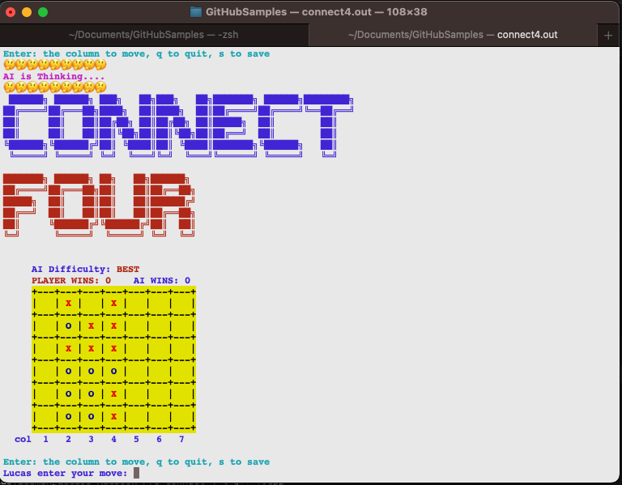
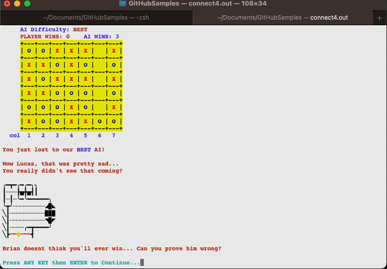

# Connect Four in Color with MinMax AI
Connect Four with AI using the MinMax algorithm with alpha-beta pruning. 

1st Place Winner of 2018 Umich EECS 183 Connect 4 AI Competition sponsored by J.P. Morgan & T.D. Ameritrade.

## Description
This program allows the user to play Connect Four against an AI that uses the MiniMax algorithm with alpha-beta pruning

The CLI gameboard is colored using ANSI escape codes. If you are using Windows, you will need to enable ANSI escape codes in your terminal.

## Usage
1. Clone the repository
2. Build: ```g++ *.cpp -o connect4.out```
3. Run: ```./connect4.out```

## Screenshots:


